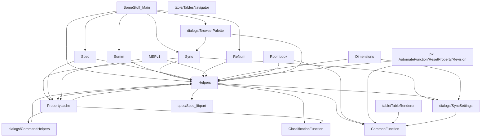
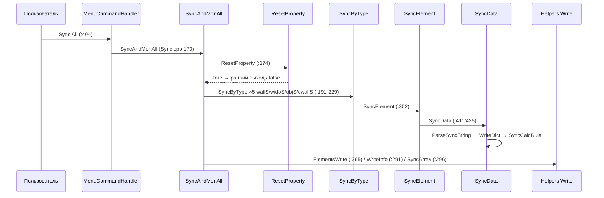
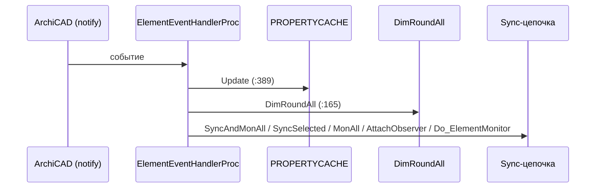
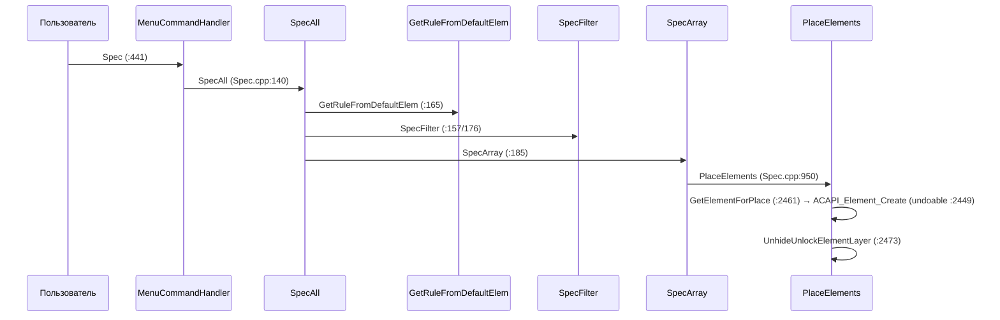
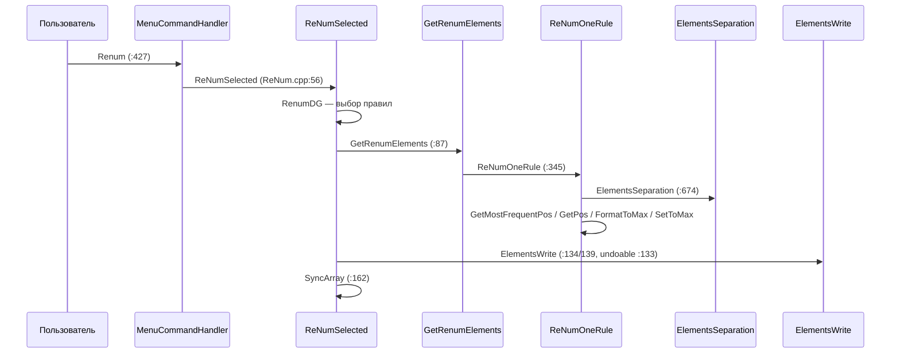
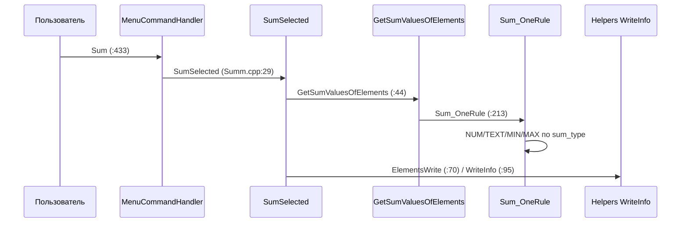
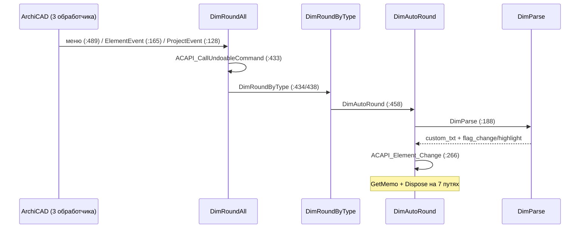
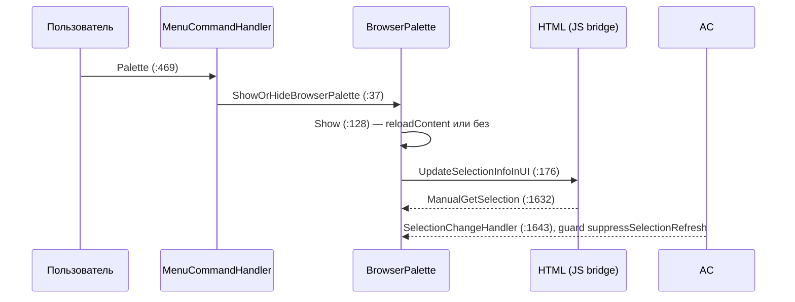
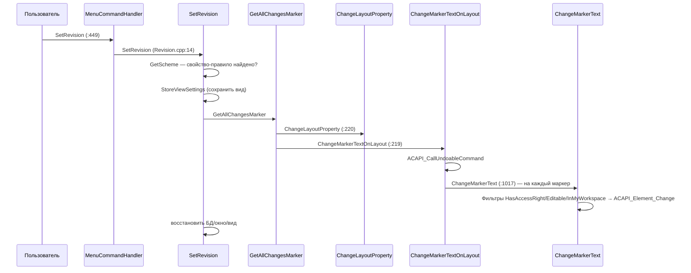
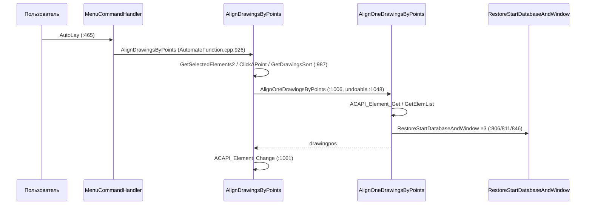

# Архитектура AddOn_SomeStuff

## Обзор

ArchiCAD C++ Add-On для работы со стройдокументацией. Поддерживает ArchiCAD 22–29 (Win + macOS). Код расположен в `Sources/AddOn/`.

## Структура каталогов

```
Sources/AddOn/
├── SomeStuff_Main.cpp/hpp   — Точка входа, интерфейс, меню, observer'ы
├── Helpers.*                — Ядро: свойства, выбор, параметры
├── Propertycache.*          — Кэш свойств/классификации/атрибутов
├── Sync.*                   — Синхронизация свойств, мониторинг
├── Summ.*                   — Суммирование свойств
├── Spec.*                   — Правила спецификаций
├── ReNum.*                  — Перенумерация
├── Revision.*               — Ревизионные маркеры
├── Dimensions.*             — Размеры (см. AGENTS.md §16: pen_original не менять)
├── Roombook.*               — Спецификация отделки
├── ClassificationFunction.* — Авто-классификация
├── ResetProperty.*          — Сброс свойств (см. AGENTS.md §6: undo-регионы)
├── AutomateFunction.*       — Автоматизация/выравнивание (pk/)
├── MEPv1.*                  — MEP
├── CommonFunction.*         — Утилиты
├── dialogs/                 — DG-диалоги, HTML-интерфейс
│   ├── BrowserPalette.*     — Браузер-палитра (HTML из RFIX/HTML/)
│   ├── CommandHelpers.*
│   ├── DG4rule.*
│   └── SyncSettings.*       — Настройки синхронизации (SyncSettings.dat)
├── spec/                    — Движок спецификаций
├── table/                   — Рендерер таблиц, навигатор
├── pk/                      — Автоматизация, сброс свойств, ревизии
├── api_headers/             — Заголовки ArchiCAD API
└── third_party/             — qrcodegen (встроенная библиотека)
```

## Слои архитектуры

```
┌─────────────────────────────────────────────┐
│              ArchiCAD (AC-API)              │
├─────────────────────────────────────────────┤
│            api_headers/                     │
│  APIEnvir, APICommon*, ACAPI_* wrappers     │
├─────────────────────────────────────────────┤
│          Core Helpers / Propertycache       │
│  ParamHelpers, GetSelectedElements,         │
│  PROPERTYCACHE(), ReadSyncSettingsFromFile  │
├─────────────────────────────────────────────┤
│           Application Logic                 │
│  Sync, Summ, Spec, ReNum, ResetProperty,    │
│  Revision, AutomateFunction, MEPv1,         │
│  ClassificationFunction, Roombook,         │
│  Dimensions, SomeStuff_Main                 │
├─────────────────────────────────────────────┤
│              UI Layer                       │
│  Dialogs (DG::Palette, BrowserPalette,      │
│  SyncSettings), HTML Interface              │
├─────────────────────────────────────────────┤
│           Utilities / Third-party           │
│  CommonFunction, qrcodegen                  │
└─────────────────────────────────────────────┘
```

## Граф зависимостей модулей

Строится из `#include` и `callgraph.json`



## Ключевые паттерны и правила

### Настройки (Settings)

- Настройки хранятся в `…/GRAPHISOFT/SomeStuff/SyncSettings.dat` (локально)
- `ACAPI_SetPreferences` / `Preferences_Save` — НЕ ИСПОЛЬЗОВАТЬ (пишет в каждый проект, ломает Teamwork)
- `ReadSyncSettingsFromFile` отвергает файл с mismatched `PreferencesVersion` — при добавлении настроек увеличить версию

### Кэш свойств (Propertycache)

- Ключи кэша всегда в нижнем регистре (`ToLowerCase` + `BRACEEND`)
- Значения свойств берутся только из `PROPERTYCACHE()`, никогда из `ACAPI_Property_GetPropertyValue`
- `property` — определения; значения ищутся отдельно по элементу

### JS Bridge

- Bridge = inline функции через `RegisterACAPIJavaScriptObject`
- JSON-команды были удалены (b7a996b) — не reintroduce
- Парсить аргументы через `DynamicCast<JSValue>` — `DynamicCast<JSArray>` крашит ArchiCAD

### Undo Regions

- Один undo-region на пользовательское действие, никогда на элемент (сотни undo-шагов иначе)
- `ResetProperty` — см. AGENTS.md §6

### Highlight Elements

- `APIIo_HighlightElementsID` + `APIDo_ZoomToElementsID` триггерят `SelectionChangeHandler` → сброс палитры
- Фикс: `static suppressSelectionRefresh` на время подсветки
- `SetElementHighlight` — только AC26+/27+; AC25 использовать `ACAPI_Interface` напрямую

### Palette Window Resize

- Docked palette width принадлежит dock manager — `SetClientWidth` игнорируется при доке
- Рецепт: `UnDock()` → `SetClientWidth()` → `Dock()`
- `GetMinClientWidth()` == original width → `SetMinClientWidth` релаксировать ПЕРЕД уменьшением

## Сборка

- `Tools/BuildAddOn.py` — сборка и конфигурация
- Win: `python Tools\BuildAddOn.py -c config.json -v <version>`
- Mac: `python3 Tools/BuildAddOn.py -c config.json -v <version>`
- LSP: добавить `--lsp` к команде
- Тесты: `Sources/AddOn/TestFunc.cpp/.hpp` (активны под `TESTING`)

## Версии

- Поддержка: AC 22–29 (определять по задаче через build config, #if блоки или тесты)
- Условные компиляции: `ServerMainVers_2300`, `ServerMainVers_2700`, `ServerMainVers_2800`
- `#ifdef AC_25/26/27/28` — для APICommon заголовков в ResetProperty

## Ключевые сценарии (согласованы 2026-09-22; sequence-диаграммы построены из callgraph.json/body_scan.json)

Sequence-диаграммы: `Docs/SEQUENCES.md` (набор согласован 2026-09-22).

Список для sequence-диаграмм (фаза 4, рисовать после согласования):

1. Полная синхронизация: меню → SyncAndMonAll → SyncByType → SyncElement → SyncData → запись свойств
2. Мониторинг изменений: ElementEventHandlerProc → SyncData (throttling через IsElementThrottled)
3. Спецификация: SpecAll → GetRuleFromDescription → GetElementsForRule → PlaceElements
4. Перенумерация: ReNumSelected → RenumDG (выбор правил) → ReNumOneRule
5. Суммирование: SumSelected → Sum_GetElement → Sum_OneRule → запись в свойство/проект
6. Округление размеров: DimRoundAll → DimAutoRound → DimParse (правила из PROPERTYCACHE)
7. Палитра: ShowOrHideBrowserPalette → HTML → JS bridge → ManualGetSelection/HighlightElements
8. Ревизии: SetRevision → обход маркеров → ChangeMarkerText
9. Выравнивание чертежей: AlignDrawingsByPoints → AlignOneDrawingsByPoints
10. Сброс свойств: ResetProperty → ResetPropertyElement2Defult → обход БД


### 1. Полная синхронизация (меню)


### 2. Мониторинг изменений (событие элемента)


### 3. Спецификация


### 4. Перенумерация


### 5. Суммирование


### 6. Округление размеров


### 7. Палитра (BrowserPalette)


### 8. Ревизии


### 9. Выравнивание чертежей


### 10. Сброс свойств
```mermaid
sequenceDiagram
    participant U as Пользователь / Sync
    participant R as ResetProperty
    participant P as ResetPropertyElement2Defult
    participant D as ResetElementsDefault
    participant I as ResetElementsInDB
    participant O as ResetOneElemen
    Note over R: AC27+: return false (баг)
    U->>R: ResetProperty (ResetProperty.cpp:14; из SyncAndMonAll :174)
    R->>P: ResetPropertyElement2Defult (:34)
    P->>D: ResetElementsDefault
    D->>D: ResetOneElemenDefault ×N (variationID)
    P->>I: ResetElementsInDB — по БД (текущая/фасады/…)
    I->>O: ResetOneElemen — на каждый элемент
    O->>O: ACAPI_Element_SetProperties (undoable :286)
    Note over O: только не-default; нечего сбрасывать → APIERR_MISSINGCODE
```
