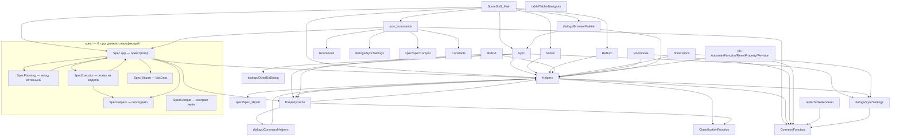

# Архитектура AddOn_SomeStuff

> Обновлено 2026-09-25 (рабочее дерево `llm_test`, HEAD `13c1948`): добавлен слой `json_commands/` (#205/#206/#207/#208) и `dialogs/OtherDbDialog.*` (#210).

## Обзор

ArchiCAD C++ Add-On для работы со стройдокументацией. Поддерживает ArchiCAD 22–29 (Win + macOS). Код расположен в `Sources/AddOn/`. HTTP/JSON-команды доступны только с AC25 (`ServerMainVers_2500`).

## Структура каталогов

```
Sources/AddOn/
├── SomeStuff_Main.cpp/hpp   — Точка входа, интерфейс, меню, observer'ы
├── Helpers.*                — Ядро: свойства, выбор, параметры
├── Propertycache.*          — Кэш свойств/классификации/атрибутов
├── Sync.*                   — Синхронизация свойств, мониторинг
├── Summ.*                   — Суммирование свойств
├── ReNum.*                  — Перенумерация
├── Dimensions.*             — Размеры (см. AGENTS.md §16: pen_original не менять)
├── Roombook.*               — Спецификация отделки
├── ClassificationFunction.* — Авто-классификация
├── MEPv1.*                  — MEP
├── CommonFunction.*         — Утилиты
├── tests/                   — Локальные тесты (TESTING)
│   ├── TestFunc.*           — реестр наборов + бэкенд TestKit
│   ├── TestKit.*            — отчёт, счётчики, отбор SMSTF_TEST
│   └── Test{Spec,Sync,Param,Format,Renum,Core,Util}.*
├── Constants.hpp            — Справочник констант
├── dialogs/                 — DG-диалоги, HTML-интерфейс
│   ├── BrowserPalette.*     — Браузер-палитра (HTML из RFIX/HTML/)
│   ├── CommandHelpers.*
│   ├── DG4rule.*
│   ├── SyncSettings.*       — Настройки синхронизации (SyncSettings.dat)
│   └── OtherDbDialog.*      — Выбор базы/этажа для связанных элементов (#210)
├── json_commands/           — JSON-команды AC25+ (#205/#206/#207/#208)
│   ├── CommandBase.*, JsonCommandRegistrar.*
│   ├── RoomBookCommand.*, SpecCommand.*, HealthCommand.*
│   └── How JSON Commands work.md
├── spec/                    — Движок спецификаций, 6 .cpp + 6 .hpp:
│   │                          Spec (оркестратор), SpecPlanning (вклад источника),
│   │                          SpecExecutor (этапы на модели), SpecHelpers (сетка/дамп),
│   │                          SpecCompat (контракт имён), Spec_libpart (ListData)
├── table/                   — Рендерер таблиц, навигатор
├── pk/                      — Автоматизация, сброс свойств, ревизии
├── api_headers/             — Заголовки ArchiCAD API
└── third_party/             — qrcodegen (встроенная библиотека)
```

## Слои архитектуры

```
┌─────────────────────────────────────────────┐
│              ArchiCAD (AC-API)              │
├─────────────────────────────────────────────┤
│            api_headers/                     │
│  APIEnvir, APICommon*, ACAPI_* wrappers     │
├─────────────────────────────────────────────┤
│          Core Helpers / Propertycache       │
│  ParamHelpers, GetSelectedElements,         │
│  PROPERTYCACHE(), ReadSyncSettingsFromFile  │
├─────────────────────────────────────────────┤
│           Application Logic                 │
│  Sync, Summ, spec/ (6 модулей), ReNum,        │
│  pk/(ResetProperty, Revision, Automate),   │
│  MEPv1, ClassificationFunction, Roombook,  │
│  Dimensions, SomeStuff_Main,               │
│  json_commands/ (AC25+ HTTP API)           │
├─────────────────────────────────────────────┤
│              UI Layer                       │
│  Dialogs (DG::Palette, BrowserPalette,      │
│  SyncSettings), HTML Interface              │
├─────────────────────────────────────────────┤
│           Utilities / Third-party           │
│  CommonFunction, qrcodegen                  │
└─────────────────────────────────────────────┘
```

## Граф зависимостей модулей

Строится из `#include` и `callgraph.json`


```mermaid
graph TD
    Main[SomeStuff_Main] --> Sync
    Main --> Spec
    Main --> Summ
    Main --> ReNum
    Main --> Helpers
    Main --> BP[dialogs/BrowserPalette]
    Main --> JC[json_commands]
    JC --> RB2[Roombook]
    JC --> SS2[dialogs/SyncSettings]
    JC --> Spec
    JC --> SC[spec/SpecCompat]
    JC --> CF
    JC --> Const[Constants]
    Sync --> OD[dialogs/OtherDbDialog]
    Sync --> Helpers
    Sync --> PC[Propertycache]
    Sync --> SS[dialogs/SyncSettings]
    Summ --> Helpers
    Spec --> Helpers
    Spec --> PC
    ReNum --> Helpers
    Helpers --> PC
    Helpers --> CF[CommonFunction]
    Helpers --> CFu[ClassificationFunction]
    Helpers --> SL[spec/Spec_libpart]
    Helpers --> SS
    PC --> Helpers
    PC --> CH[dialogs/CommandHelpers]
    PC --> CFu
    MEPv1 --> Helpers
    MEPv1 --> PC
    Dim[Dimensions] --> Helpers
    Dim --> SS
    RB[Roombook] --> Helpers
    RB --> CF
    PK[pk: AutomateFunction/ResetProperty/Revision] --> Helpers
    PK --> CF
    TR[table/TableRenderer] --> CF
    TN[table/TablesNavigator]
    BP --> Sync
    BP --> Helpers
    CH[dialogs/CommandHelpers] --> Helpers
    SS --> CF

    subgraph SPEC[spec/ — 6 .cpp, движок спецификаций]
        Spec[Spec.cpp — оркестратор]
        SP[SpecPlanning — вклад источника]
        SE[SpecExecutor — этапы на модели]
        SH[SpecHelpers — сетка/дамп]
        SC2[SpecCompat — контракт имён]
        SL2[Spec_libpart — ListData]
    end
    Spec --> SP
    SP --> Spec
    Spec --> SE
    SE --> SH
    Spec --> SH
    Spec --> SL2
    SE --> Spec
```

## Ключевые паттерны и правила

### Настройки (Settings)

- Настройки хранятся в `…/GRAPHISOFT/SomeStuff/SyncSettings.dat` (локально)
- `ACAPI_SetPreferences` / `Preferences_Save` — НЕ ИСПОЛЬЗОВАТЬ (пишет в каждый проект, ломает Teamwork)
- `ReadSyncSettingsFromFile` отвергает файл с mismatched `PreferencesVersion` — при добавлении настроек увеличить версию

### Кэш свойств (Propertycache)

- Ключи кэша всегда в нижнем регистре (`ToLowerCase` + `BRACEEND`)
- Значения свойств берутся только из `PROPERTYCACHE()`, никогда из `ACAPI_Property_GetPropertyValue`
- `property` — определения; значения ищутся отдельно по элементу

### JS Bridge

- Bridge = inline функции через `RegisterACAPIJavaScriptObject`
- Парсить аргументы через `DynamicCast<JSValue>` — `DynamicCast<JSArray>` крашит ArchiCAD
- Bridge и JSON-команды — разные каналы: мост = инлайн-функции CEF-палитры, JSON-команды = HTTP API `API_AddOnCommand` (AC25+). JSON-канал восстановлен в #205/#206 (карточка `Docs/modules/json_commands.md`)

### JSON-команды (AC25+)

- `RegisterJsonCommands()` из `Initialize` (SomeStuff_Main.cpp:569): `RoomBookCommand` и `SpecCommand`; `HealthCommand` — шаблон, не регистрируется (решение #205)
- Выполнение: `ScheduleForExecutionOnMainThread` — модифицирующие операции только в главном потоке
- `#include "ACAPinc.h"` ДО проверки `ServerMainVers_2500` в каждом `.cpp` (макрос версии даёт именно этот заголовок), иначе пустая единица трансляции
- Выбор экземпляра Archicad — через HTTP-порт вызывающего, параметром не передаётся

### Undo Regions

- Один undo-region на пользовательское действие, никогда на элемент (сотни undo-шагов иначе)
- `ResetProperty` — см. AGENTS.md §6

### Highlight Elements

- `APIIo_HighlightElementsID` + `APIDo_ZoomToElementsID` триггерят `SelectionChangeHandler` → сброс палитры
- Фикс: `static suppressSelectionRefresh` на время подсветки
- `SetElementHighlight` — только AC26+/27+; AC25 использовать `ACAPI_Interface` напрямую

### Palette Window Resize

- Docked palette width принадлежит dock manager — `SetClientWidth` игнорируется при доке
- Рецепт: `UnDock()` → `SetClientWidth()` → `Dock()`
- `GetMinClientWidth()` == original width → `SetMinClientWidth` релаксировать ПЕРЕД уменьшением

## Сборка

- `Tools/BuildAddOn.py` — сборка и конфигурация
- Win: `python Tools\BuildAddOn.py -c config.json -v <version>`
- Mac: `python3 Tools/BuildAddOn.py -c config.json -v <version>`
- LSP: добавить `--lsp` к команде
- Тесты: `Sources/AddOn/tests/` (активны под `TESTING`); результат — файловый отчёт
  `%TEMP%\somestuff_test_report.txt`, раннер `Tools/restart_archicad_for_test.ps1`
  выдаёт `70` при провалах. Отбор наборов — переменная окружения `SMSTF_TEST`
  (группа, префикс со `*` или список через запятую)

## Версии

- Поддержка: AC 22–29 (определять по задаче через build config, #if блоки или тесты)
- Условные компиляции: `ServerMainVers_2300`, `ServerMainVers_2700`, `ServerMainVers_2800`
- `#ifdef AC_25/26/27/28` — для APICommon заголовков в ResetProperty

## Ключевые сценарии (согласованы 2026-09-22; sequence-диаграммы построены из callgraph.json/body_scan.json)

Sequence-диаграммы: `Docs/SEQUENCES.md` (набор согласован 2026-09-22).

Список для sequence-диаграмм (фаза 4, рисовать после согласования):

1. Полная синхронизация: меню → SyncAndMonAll → SyncByType → SyncElement → SyncData → запись свойств
2. Мониторинг изменений: ElementEventHandlerProc → SyncData (throttling через IsElementThrottled)
3. Спецификация: SpecAll (Spec.cpp:143) → SpecArray (:609) → GetElementsForRule (:2099) → PlanRuleRows (:1866) → BuildContribution (SpecPlanning.cpp:19) → PlaceElements (SpecExecutor.cpp:11) → WriteSpecProperties (:280)
4. Перенумерация: ReNumSelected → RenumDG (выбор правил) → ReNumOneRule
5. Суммирование: SumSelected → Sum_GetElement → Sum_OneRule → запись в свойство/проект
6. Округление размеров: DimRoundAll → DimAutoRound → DimParse (правила из PROPERTYCACHE)
7. Палитра: ShowOrHideBrowserPalette → HTML → JS bridge → ManualGetSelection/HighlightElements
8. Ревизии: SetRevision → обход маркеров → ChangeMarkerText
9. Выравнивание чертежей: AlignDrawingsByPoints → AlignOneDrawingsByPoints
10. Сброс свойств: ResetProperty → ResetPropertyElement2Defult → обход БД

**Диаграммы: `Docs/SEQUENCES.md`** — 10 согласованных sequence-диаграмм (построены из `callgraph.json` и `body_scan.json`; в самом файле ARCHITECTURE.md не дублируются).
