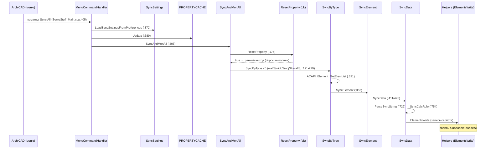
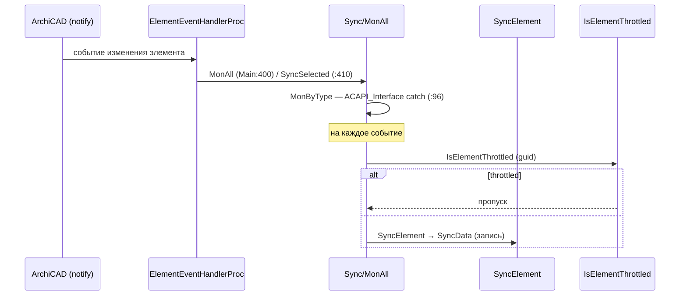
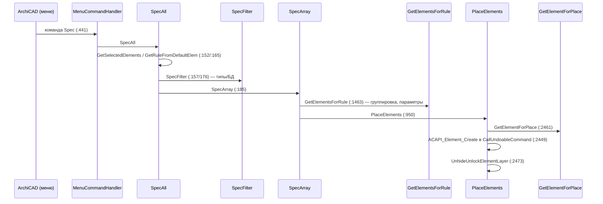
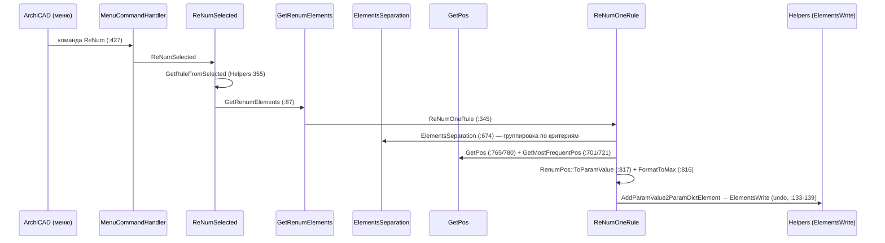
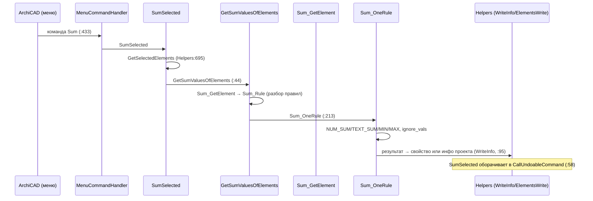
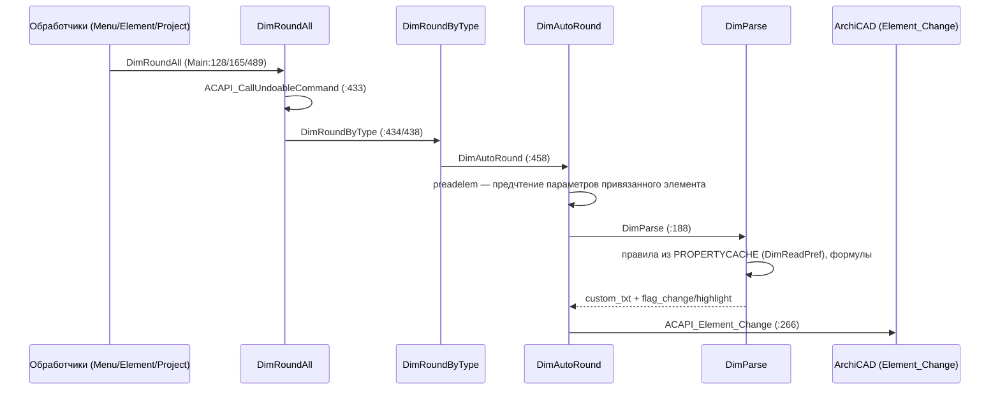
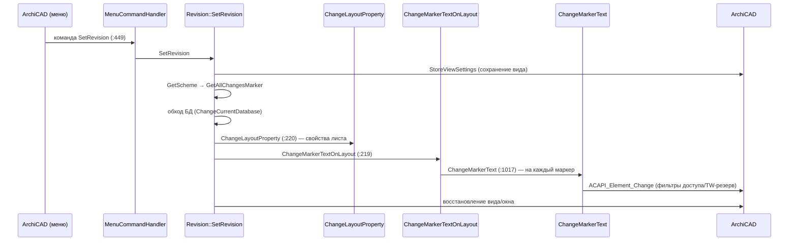
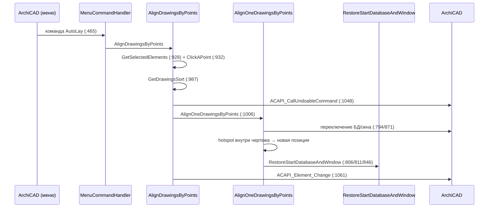
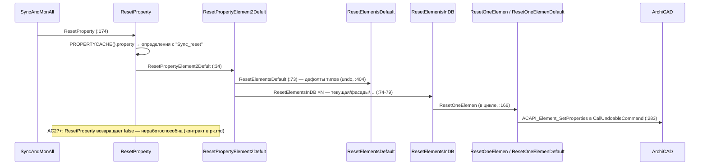

# SEQUENCES — Ключевые сценарии

> Хеш коммита: после 12874ab (2026-09-22). Набор из 10 сценариев согласован пользователем. Все сообщения — из `Docs/_generated/callgraph.json` и `body_scan.json` (координаты в тексте — 1-based).

## 1. Полная синхронизация



## 2. Мониторинг изменений элементов



## 3. Спецификация



## 4. Перенумерация



## 5. Суммирование



## 6. Округление размеров



## 7. Браузерная палитра

```mermaid
sequenceDiagram
    participant UI as ArchiCAD (меню/выделение)
    participant Main as MenuCommandHandler
    participant BP as BrowserPalette
    participant HTML as HTML (DG::Browser)
    participant SCH as SelectionChangeHandler

    UI->>Main: команда палитры (:469)
    Main->>BP: ShowOrHideBrowserPalette
    BP->>HTML: Show → загрузка Interface_ru.html
    BP->>HTML: UpdateSelectionInfoInUI — executeJS (:163)
    UI->>SCH: смена выделения
    SCH->>SCH: suppressSelectionRefresh? (:719) — при программной подсветке выход
    SCH->>BP: ManualGetSelection (:1632) → UpdateSelectionInfoInUI
    HTML->>BP: JS-мост (RegisterACAPIJavaScriptObject; аргументы DynamicCast<JSValue>)
```

## 8. Ревизии



## 9. Выравнивание чертежей



## 10. Сброс свойств


