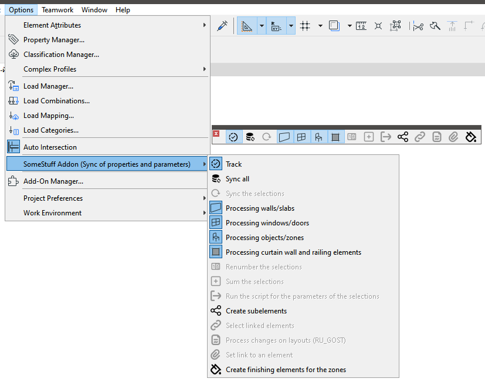
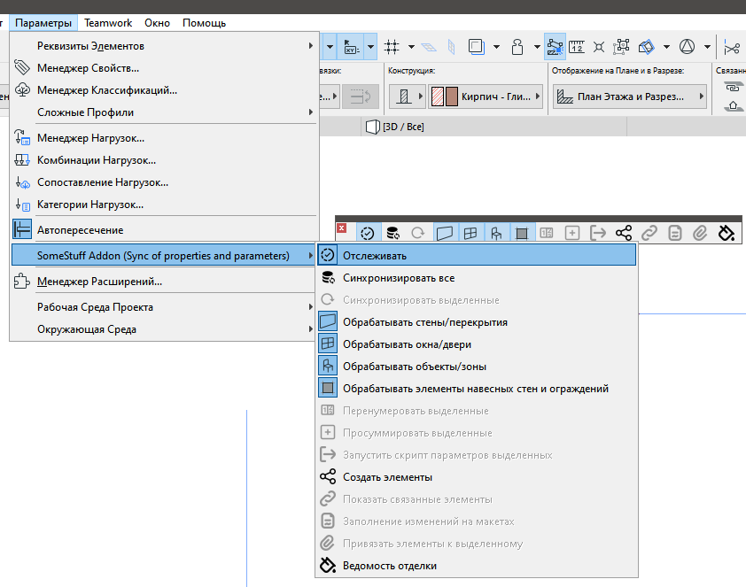

# AddOn SomeStuff

[Telegramm](https://t.me/archicad_somestuff)
---

**🇷🇺 [Русский](#-русский) · 🇬🇧 [English](#-english)**

## English

An add-on for design automation in Archicad.

The core workflow is built around properties: commands written in property descriptions instruct the add-on to populate those properties with data that Archicad cannot expose natively — GDL object parameters, element coordinates, composite structure layer compositions, and more.

The interface is bilingual — Russian or English — selected automatically based on the Archicad language.

### Features

- **GDL ↔ Property Synchronization** — write GDL object parameter values to element properties and vice versa; not possible with standard Archicad tools.
- **Flexible Numbering** — an ID Manager alternative that uses property values as criteria; results are written to properties.
- **Structure Layer Composition** — export the composition and layer count of walls, slabs, and complex profiles for any given cross-section.
- **Value Summation** — store the sum of property values in properties or in project info; useful for remote labels and calculations.
- **Coordinates & Angles** — check for fractional parts in coordinates and angles, output coordinates to properties, determine cardinal directions for walls and openings.
- **Dimension Tools** — round dimensions and numeric properties; write formulas to dimension labels (e.g. `6×100=600`).
- **Copy IFC Properties** to standard element properties.
- **Project Data** — write property values to project info fields.
- **Morph Line Length** — output to properties.
- **Auto-classification** — classify elements based on property values and export class information to properties.
- **Decompose Composite Elements** into individual construction layers.
- **MEP Data Output** — descriptions, table names, and system names in the MEP browser.
- **Track Layout Changes**.
- **Finish Schedule** and QR codes (v1.74+).

---

### Compatibility

| Archicad Version | Windows | macOS | Build Status |
|:---|:---:|:---:|:---|
| 29 | ✅ | ✅ |  |
| 28 | ✅ | ✅ |  |
| 27 | ✅ | ✅ |  |
| 26 | ✅ | ✅ |  |
| 25 | ✅ | ✅ |  |
| 24 | ✅ | — |  |
| 23 | ✅ (limited) | — |  |
| 22 | ✅ (limited) | — |  |

---

### Installation

A single package covers all Archicad language editions. The interface language (RUS / INT) is selected automatically.

Full instructions for Windows and macOS are in the [Wiki (EN): Install](https://github.com/kuvbur/AddOn_SomeStuff/wiki/Install-en).

[**⬇ Download Latest Release**](https://github.com/kuvbur/AddOn_SomeStuff/releases/latest)

---

### Documentation
- [FAQ (EN)](https://github.com/kuvbur/AddOn_SomeStuff/wiki/FAQ-en)
- [Wiki (EN)](https://github.com/kuvbur/AddOn_SomeStuff/wiki)
- [Command list (EN)](https://github.com/kuvbur/AddOn_SomeStuff/wiki/Property-Commands-List-en)
- [Example files (RU)](https://github.com/kuvbur/AddOn_SomeStuff/tree/master/wiki/files)

Release notifications on Telegram: [@archicad_somestuff](https://t.me/archicad_somestuff)

---

[⬆ Наверх](#addon-somestuff) ·

---

## Русский

Аддон для автоматизации проектирования в Archicad.

Основная работа ведётся со свойствами: на основе команд в описании свойств в них записываются данные, недоступные для вывода штатными средствами — параметры GDL-объектов, координаты элементов, состав композитных конструкций и другое.

Интерфейс двуязычный — русский или английский. Язык выбирается автоматически в зависимости от языка Archicad.

### Возможности

- **Синхронизация GDL ↔ Свойства** — запись значений параметров GDL-объектов в свойства элементов и обратно; штатными средствами Archicad недоступно.
- **Гибкая нумерация** — аналог ID Manager со свойствами в качестве критериев; результат записывается в свойства.
- **Вывод состава конструкций** — состав и количество слоёв стен, перекрытий и сложных профилей в любом заданном сечении.
- **Суммирование значений** — хранение суммы значений в свойствах или в информации о проекте; используется для выносных меток и расчётов.
- **Координаты и углы** — проверка наличия дробной части, вывод координат в свойства, определение сторон света для стен и проёмов.
- **Работа с размерами** — округление, запись формул (например, `6×100=600`).
- **Копирование IFC-свойств** в обычные свойства элементов.
- **Данные проекта** — запись значений свойств в информацию о проекте.
- **Длина линии морфа** — вывод в свойства.
- **Автоклассификация** — классификация элементов на основе значений свойств и вывод информации о классе.
- **Разбивка составных элементов** по слоям конструкции.
- **Вывод данных МЕР** — описание, имена таблиц и систем в браузере МЕР.
- **Отслеживание изменений на макетах**.
- **Ведомость отделки** и QR-коды (v1.74+).

---

### Совместимость

| Версия Archicad | Windows | macOS | Статус сборки |
|:---|:---:|:---:|:---|
| 29 | ✅ | ✅ |  |
| 28 | ✅ | ✅ |  |
| 27 | ✅ | ✅ |  |
| 26 | ✅ | ✅ |  |
| 25 | ✅ | ✅ |  |
| 24 | ✅ | — |  |
| 23 | ✅ (огр.) | — |  |
| 22 | ✅ (огр.) | — |  |

---

### Установка

Единый пакет для всех языковых версий Archicad. Язык интерфейса (RUS / INT) выбирается автоматически.

Подробная инструкция для [Windows и macOS](https://github.com/kuvbur/AddOn_SomeStuff/wiki/Установка).

[**⬇ Скачать последнюю версию**](https://github.com/kuvbur/AddOn_SomeStuff/releases/latest)

### Документация

- [FAQ RU](https://github.com/kuvbur/AddOn_SomeStuff/wiki/FAQ-ru)
- [Список команд RU](https://github.com/kuvbur/AddOn_SomeStuff/wiki/Property-Commands-List-ru)
- [Wiki RU — полная справка](https://github.com/kuvbur/AddOn_SomeStuff/wiki)
- [Примеры файлов](https://github.com/kuvbur/AddOn_SomeStuff/tree/master/wiki/files)

---

### Видеообзоры

- [Обзор от Егора Захарова — часть 1](https://www.youtube.com/watch?v=msOBRXge0ec)
- [Обзор от Егора Захарова — часть 2](https://youtu.be/s541ycUumtI)
- [Обзор версии v1.0b](https://youtu.be/XJ23-R5Rl7Y)

---

### Новости и обновления

Оповещения о новых версиях в Telegram: [@archicad_somestuff](https://t.me/archicad_somestuff)

---

[⬆ Back to top](#addon-somestuff) 

---

## License

Distributed under the [GNU General Public License v3.0](LICENSE).
